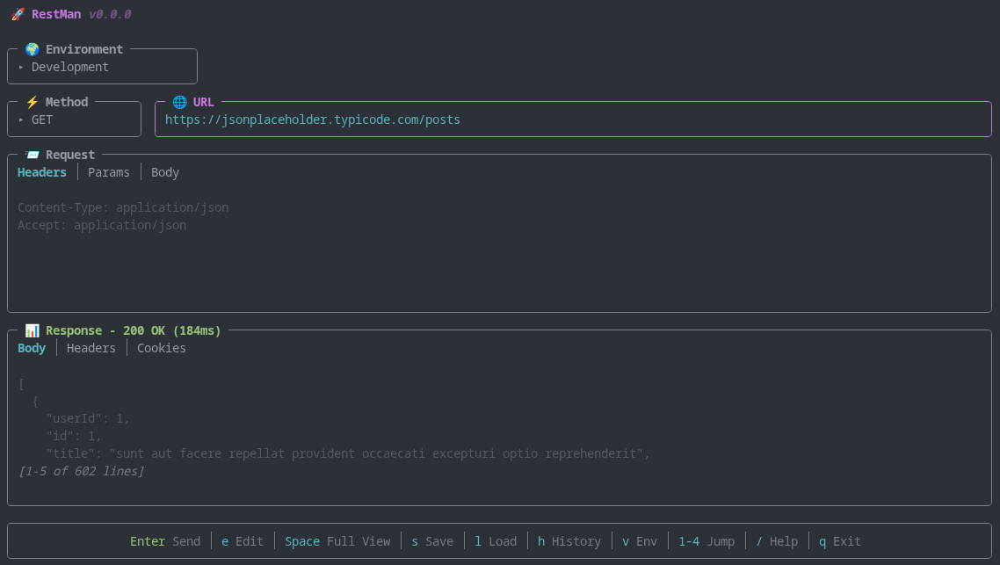
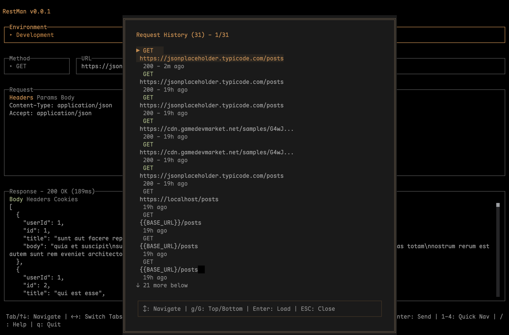
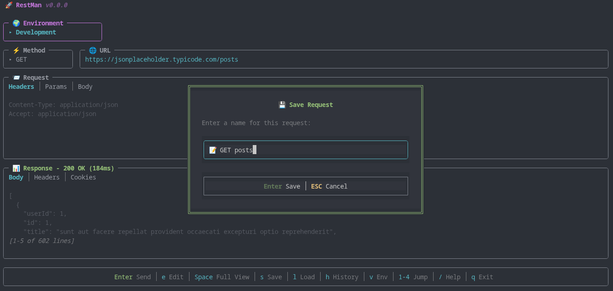
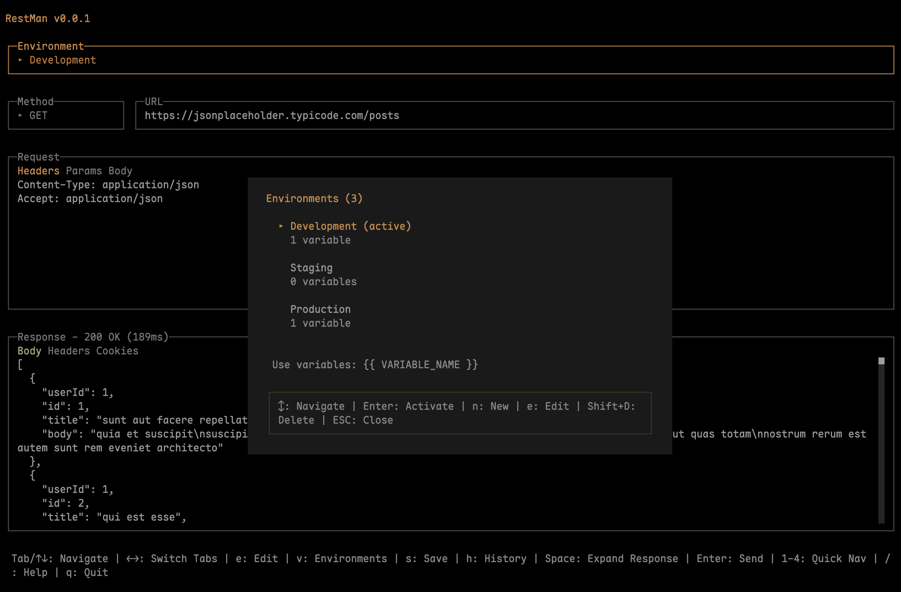
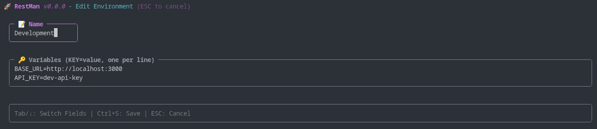
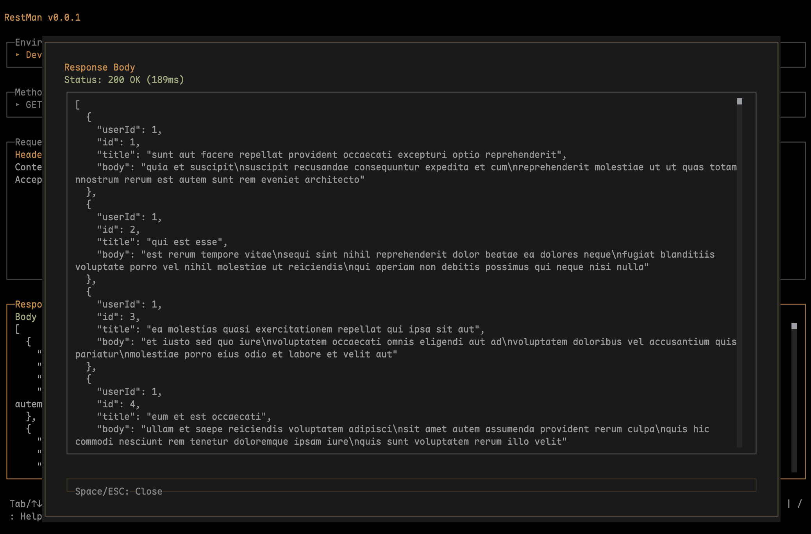
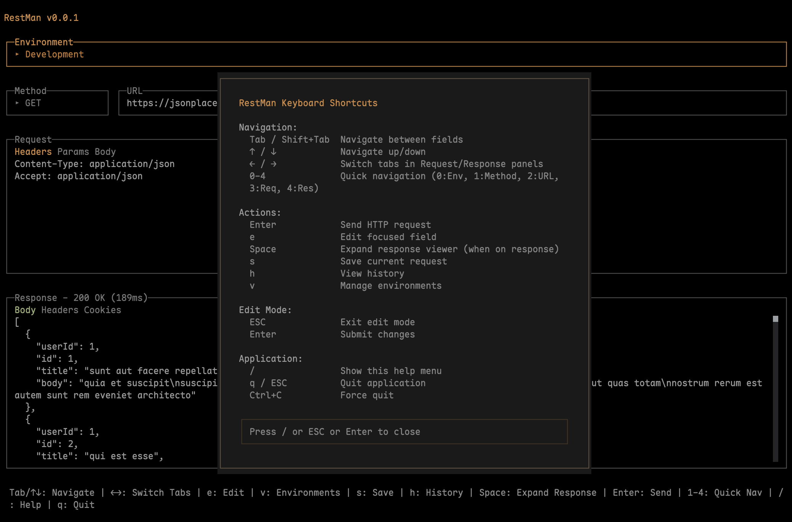

<div align="center">

# RestMan

A simple and easy to use REST API client that runs in your terminal. Open-source alternative to Postman.

   



</div>

## ❤️ Sponsors

Support development by becoming a sponsor! Your avatar or company logo will appear below.

[Become a Sponsor](https://github.com/sponsors/cadamsdev)

<!-- Sponsors will appear here -->

## ✨ Features

- Make HTTP requests (GET, POST, PUT, PATCH, DELETE)
- Add custom headers, query params, and request body
- View response status, headers, timing, and formatted body
- Save frequently-used requests and browse history
- Manage environments with variable substitution (`{{BASE_URL}}`, `{{API_KEY}}`, etc.)
- Fully keyboard-driven (no mouse required)

## 📸 Screenshots

<details>
<summary>Click to view screenshots</summary>

### Main Interface


### Request History


### Save Requests


### Environment Management


### Environment Editor


### View Full Response


### Change HTTP Method


### Help Menu


</details>

## 📦 Installation

### Quick Install

**Linux & macOS:**
```bash
curl -fsSL https://userestman.vercel.app/install.sh | bash
```

**Windows:**
```powershell
powershell -c "irm https://userestman.vercel.app/install.ps1 | iex"
```

### Manual Installation

Download the latest release for your platform from [GitHub Releases](https://github.com/cadamsdev/restman/releases/latest):

- **Linux:** `restman-linux-x64.tar.gz` or `restman-linux-arm64.tar.gz`
- **macOS:** `restman-darwin-x64.zip` or `restman-darwin-arm64.zip`
- **Windows:** `restman-windows-x64.zip`

Extract the archive and add the binary to your PATH.

**macOS users:** After extracting, you may need to remove the quarantine attribute:
```bash
xattr -d com.apple.quarantine /path/to/restman
```

## 🚀 Usage

### Running the Application

```bash
restman
```

## 📁 Project Structure

```
restman/
├── index.tsx           # Application entry point
├── src/                # Source code
│   ├── App.tsx         # Main application component
│   ├── components/     # React UI components
│   ├── *-storage.ts    # Data persistence modules
│   └── *.ts            # Core utilities (HTTP, variables, tokens)
├── website/            # Project website and landing page
├── docs/               # Documentation
├── media/              # Screenshots and assets
├── scripts/            # Build and utility scripts
├── .github/            # GitHub workflows and templates
└── package.json        # Dependencies and scripts
```

## 🛠️ Development

```bash
# Run the app
bun dev
```

## 🤝 Contributing

Contributions are welcome! Feel free to open issues or submit pull requests.

## 📚 Documentation

- [Keyboard Shortcuts](docs/KEYBOARD_SHORTCUTS.md) - Complete list of keyboard shortcuts and navigation
- [Environment Variables](docs/ENVIRONMENT_VARIABLES.md) - Guide to managing environments and variable substitution

## 📄 License

MIT
